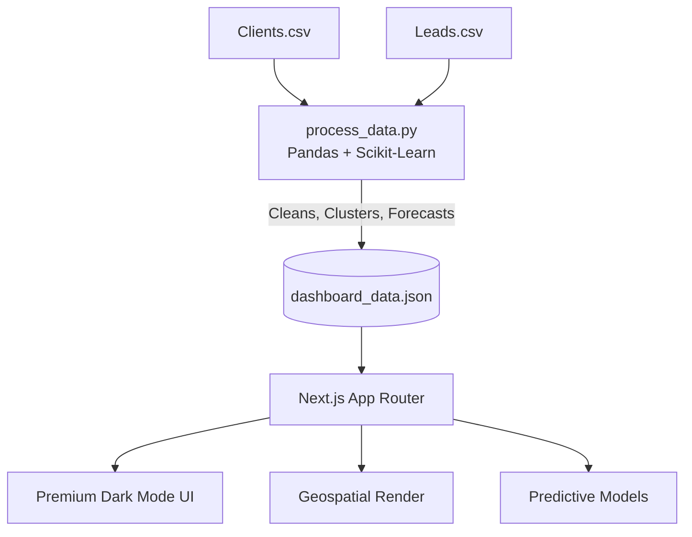

# DreamShift Industry Intelligence Dashboard


DreamShift Industry Intelligence Dashboard is a private, production-grade analytical platform built to process raw CRM data into actionable acquisition insights, geographic lead mapping, and predictive forecasts.

It brings together:

- Executive overview of active clients and tally leads
- Industry-specific lead-to-client conversion matrices
- Geospatial lead distribution heatmaps across Australia
- Machine learning-powered conversion probabilities and clustering
- Time-series forecasting for future client acquisition
- A sleek, premium dark-mode UI

Built and engineered by **Navodhya Fernando**.

---

## Features

### Automated Data Pipeline

Python ETL script that cleans, standardizes, and processes raw CRM CSV files into optimized JSON.

### Geospatial Intelligence

Interactive map of Australia displaying lead density by state, featuring a custom caching and rendering engine to avoid SSR hydration issues.

### Advanced Data Visualization

Dynamic, responsive donut charts and trend indicators using Recharts, designed specifically for a premium dark theme.

### Lead-to-Client Velocity Matrix

Deep-dive tables calculating exact conversion rates, including dedicated tracking for high-quality leads.

### Predictive Analytics

- **Logistic Regression:** Calculates conversion probabilities by industry
- **K-Means Clustering:** Identifies top converting user personas based on industry, state, and visa status
- **Exponential Smoothing:** Generates a 30-day forward-looking forecast of client acquisitions

---

## Benefits

- **Zero-Touch Reporting:** Eliminates manual spreadsheet crunching with a unified Python-to-React pipeline
- **Predictive Growth:** Moves beyond historical reporting by using ML to identify high-converting personas and forecast future trends
- **Executive Visibility:** Consolidates complex CRM data into a clean, scannable command center
- **Performant Architecture:** Static JSON consumption via Next.js ensures fast load times and zero database latency on the frontend
- **Bulletproof UI:** Custom flexbox layouts and client-side mounting patterns prevent layout breaks across screen sizes

---

## Tech Stack

### Frontend

- Next.js 14+ App Router
- React
- TypeScript / JavaScript

### UI System

- Tailwind CSS
- Recharts
- React Simple Maps
- Premium dark-mode interface

### Data Pipeline

- Python 3
- Pandas
- NumPy

### Machine Learning

- Scikit-Learn
- Statsmodels

### Data Layer

- Static JSON generated through automated Python scripts

---

## Why This Project Reflects My Engineering Profile

- Full-stack ownership across data science, ETL, machine learning, and frontend architecture
- Ability to translate complex backend calculations into a polished executive-facing dashboard
- Real-world engineering problem solving, including custom workarounds for third-party library limitations
- Clean separation of concerns, with Python handling heavy data processing and React handling presentation
- Fast, scalable frontend architecture powered by optimized static JSON

---

## System Architecture

### Architecture Components




---

## How Data Flows

1. Raw CRM data, including `Clients.csv` and `Leads.csv`, is securely placed inside the `raw_data` folder.

2. The Python pipeline, `process_data.py`, runs and performs data cleaning, industry standardization, conversion calculations, clustering, and forecasting.

3. The pipeline outputs a single optimized `dashboard_data.json` file.

4. The JSON file is stored inside the Next.js frontend at:

```plaintext
public/data/dashboard_data.json
```

5. Next.js statically consumes the JSON file, resulting in fast, zero-latency data delivery.

6. React components render the executive overview, geospatial maps, industry metrics, and predictive intelligence sections.

---

## Repository Structure

```plaintext
industry-dashboard/
  raw_data/
    # Ignored by git
    # Drop CRM CSV files here

  process_data.py
    # Python ETL and ML pipeline

  public/
    data/
      dashboard_data.json

  src/
    app/
      # Next.js pages, layouts, and global CSS

    components/
      section-1-overview/
        # KPI cards, summary tables, donut charts

      section-2-industry/
        # Geospatial map and deep-dive metrics

      section-3-predictive/
        # ML personas and forecast charts
```

---

## Quick Start

### Prerequisites

Make sure you have the following installed:

- Node.js 18+
- npm 10+
- Python 3.9+
- pip

---

## Installation and Setup

### 1. Install Node Modules

```bash
npm install
```

### 2. Install Python Dependencies

```bash
pip install pandas numpy scikit-learn statsmodels
```

### 3. Provide Raw Data

Place the following files inside the `/raw_data/` directory at the root of the project:

```plaintext
Clients.csv
Leads.csv
```

---

## Running the Pipeline and Server

### 1. Process the Data

Run the Python script to generate the latest JSON file.

```bash
python process_data.py
```

### 2. Start the Frontend

```bash
npm run dev
```

Open the dashboard at:

```plaintext
http://localhost:3000
```

---

## Build and Production Run

### Build the Project

```bash
npm run build
```

### Start the Production Server

```bash
npm run start
```

Important: Run `python process_data.py` before `npm run build` to make sure Next.js uses the latest data.

---

## Security and Access Notes

This repository uses a strict `.gitignore` to ensure raw CRM data is never committed to version control.

The following files should remain private and excluded from Git:

```plaintext
raw_data/*.csv
```

Only aggregated and anonymized metrics inside `dashboard_data.json` are exposed to the frontend build process.

---

## License

This software is private and proprietary.

See `LICENSE` for usage restrictions.